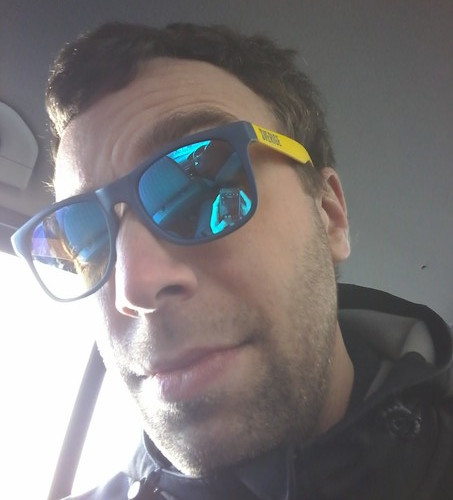

[orcid](https://orcid.org/0000-0002-9036-8321) | 
[publons](https://publons.com/researcher/2915880/jan-koci/) | 
[scholar](https://scholar.google.com/citations?user=T-A4CwMAAAAJ&hl=en&oi=sra) | 
[researchgate](https://www.researchgate.net/profile/Jan_Koci2)

I am currently a PhD student of biology at the University of Ostrava. My projects mostly revolve around evolutionary genomics of a really weird fish - European loaches, which hybridize between species, lose sex like car keys, then switch to clonality like no big deal, find and keep foreign genomes just in case, and generally give geneticists a headache by ignoring all the textbooks, while spending most of their days pretending to be sand.

But I'm interested in everything evolutionary!

Bibliophile, computer geek, linux enthusiast, nature lover, hiker, bushman & kungfu killing machine :)
