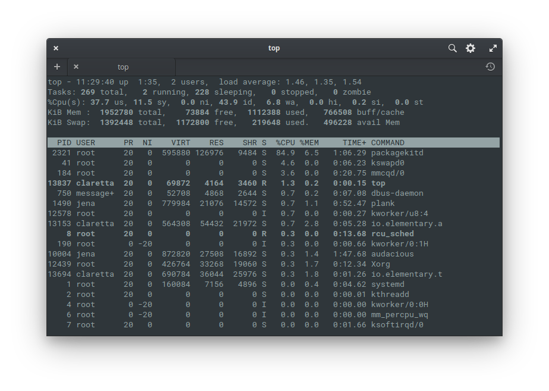
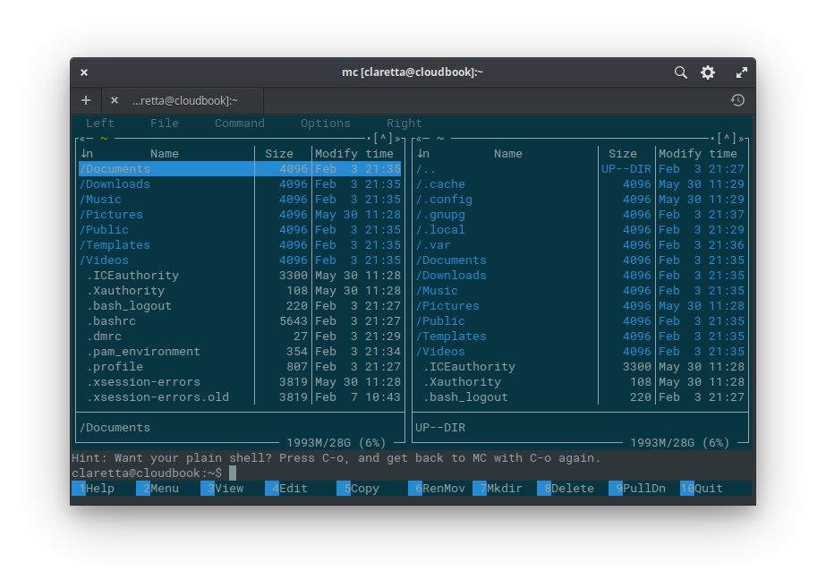
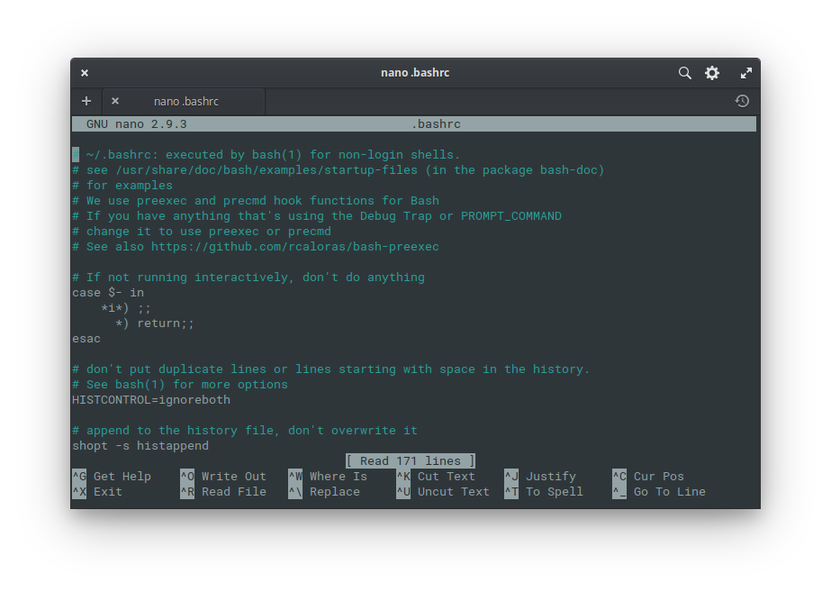
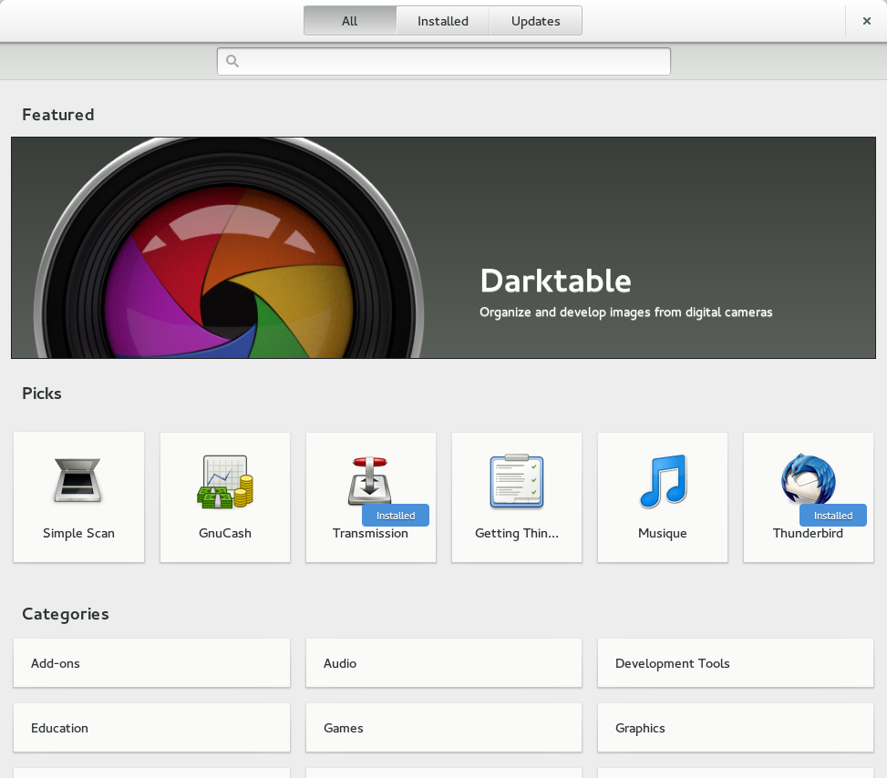
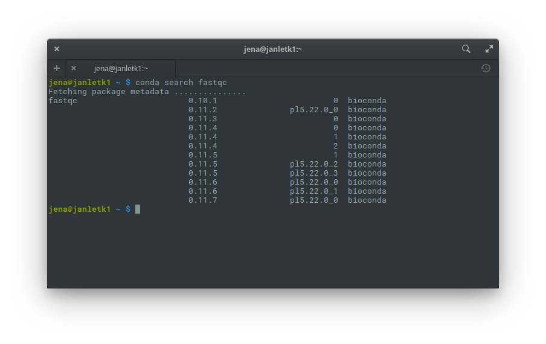

*Linux for terrified biologists*

## Contents
- Preface - What is this?
- Connection
  - SSH - secure shell
- First linux commands
  - Looking around
  - Command parameters
  - Helpful manuals
- Syntax
- Playing with files and stuff
  - Standard output and redirecting
  - Wildcards
  - Interactive commands
- Life in the commandline
  - Midnight Commander - the saviour
  - Text editors
    - MCedit
    - Nano
    - Other editors
- Keep the work running
  - Disown & nohup
  - Screen
  - Qsub / Bsub & co.
- Installing software
  - Scientific package managers
    - Conda
    - Linuxbrew
- Sequences everywhere
  - Data overview
    - Quality control
  - Burrows-Wheeler algorithm (BWA)

***

## Preface - What is this?
This document started as my notes for the Genome analysis course taught by Dr. Flegontov, that I took at the University of Ostrava in 2016. Soon I turned it into a short tutorial for my classmates (and my supervisor, then interested in learning the subject). I still update it every now and then, so it's work in progress. You can comment on stuff you would like to clarify or expand and I'll try my best to improve it.

I'm by NO means an expert. On the contrary - I'm far from the level of dr. Flegontov, only maybe a few lessons ahead of other students in the group.

But precisely for this reason I know the struggles of beginners, because they are still in my memory (some quite alive). I went through similar problems recently and I think it might have helped if I had something akin to this small tutorial at hand. Google can be overwhelming at times, right? :)

**Update:** Originally I started with Google Docs, this version uses Markdown and Github instead.

***

## Connection
For setting up connection to linux server you need **Eduroam** or similar open network (your home wifi is fine too), because osu-simple allows only http(s) protocol (i.e. web). You can get all the necessary info on the [university website](http://eduroam.osu.cz/).

There you will also find a link to special [tools](https://cat.eduroam.org/?idp=821) that will set the network for you (works on Windows, Linux, Mac and even Android and iOS).

login: **name@osu.cz** (even if you are student, it's still something like **P12345@osu.cz**)

password: needs to be set on [Portal](https://portal.osu.cz) (it's special for eduroam only).

### SSH - secure shell
To connect from **Windows** you need ssh client, e.g. the simple [Putty](http://www.putty.org/) or the excellent [MobaXterm](http://mobaxterm.mobatek.net/). There you will fill the login details.

To connect from **Linux** you just open **Terminal** (try pressing Ctrl+Alt+T) and type command in this form:

	ssh -p 22 studentuser@genome.osu.cz

The number after `-p` is port; 22 is default and can be omitted, but you can be told to use different port.

To connect from **Mac** you also just open **Terminal** and type something like this:

	ssh studentuser@genome.osu.cz -p22

***

## First linux commands
### Looking around
So you have successfully connected to some linux machine (server) and now you want to look around. You see a bunch of text on a black screen, **now what**? If you look down at the bottom line, it says something like:

	studentuser@ubuntu2:~$

This is the infamous **linux command line** and it waits for your input (that is the `$` symbol at the end - if you see it there, you can type your commands next to it).

To look around, type:

	ls # lists contents of current folder

which will show content of a folder you are in. If you are familiar with R statistical environment you might notice it looks like R command `ls()`. And indeed it has similar function. You might also notice the `#` with **comment** after it - that's also similar to R. I will use it to comment on what something does - if you copy it into the command line with the command, nothing extra happens, just as in R ;) **Everything between `#` and new line (Enter) is ignored by linux.**

Now you can do some stuff with what you see in the folder, like:

```bash
cp # copy
mv # move (cut+paste; can be used as rename)
rm # remove (delete)
mkdir # make directory (folder)
cd # change directory (go through folders)
pwd # path to working (current) directory (i.e. where you are)
```

So if you want to go into **subdirectory**, you can just type e.g. `cd Jena` and you will get there. If you want to **go back (up)**, you just type

	cd .. # two dots mean directory above in hierarchy

You can enter the path to the folder in several ways, some more lazy than others:

```bash
cd Jena # change to subfolder of current folder, named 'Jena'
cd ./Jena/ # same as above, using full relative path syntax
cd /home/studentuser/Jena # same as above, using absolute path
cd / # change to root directory of the system (like C:/)
cd ~ # go home ;) i.e. /home/studentuser
```

*Tip: one dot represents directory you are currently in. That's sometimes used for running scripts etc.*

To copy file into some subdirectory, just type:

```bash
cp file.txt Jena/ # copies file.txt into Jena directory
cp file.txt Jena/renamed.txt # rename file during transfer
```

*Tip: If you want to recall previous command, press arrow up (like in R). Now you can modify it and confirm with Enter. Also, if you start typing name of file/folder like Je.. and hit Tab, it will fill in the rest of the name - magic! :) But only if there is nothing else starting with the same letters Je.. - in such case hit Tab second time and it will tell you what other files match what you type. That’s double magic, my friend :)*

	ls Jena # check content of subfolder without going there

### Command parameters
Now you can also add some parameters to commands, e.g.:

	ls -l # lists content of current folder with details like size

### Helpful manuals
Every command tool has its manual, which lists all the parameters and other useful info about the command. It's very similar to R help. In R you type `?ls` or `help(ls)` while in linux you can get it like this:

	man ls # shows manual page of the command ls

This is probably the most helpful thing you will find here :)

*Tip: the manual opens in interactive mode so you can move the page with arrows etc. Press Q to quit the manual page ;)*

***

## Syntax
You may have noticed a few similarities with the R language. Linux command line actually uses its own language called bash (but can easily use some others, like awk or perl).

In R you have syntax like this:

	function(parameter1=value1, par2=value2, ...) # R syntax

The same in bash would be:

	function --parameter value # bash syntax

Many parameters have shortcuts which look like this:

	function -p value # shorter version

*Tip: You can find both long and short version in the man page of particular command.*
 
Let's try something more. In R you can see objects in the environment with `ls()` but you can also save its result into new object like this:

	x <- ls() # R version of creating dummy object

Basically what you do is that you redirect output of a function from standard output (stdout, typically your screen) into an object. The logic of bash is very similar:

	ls > x # bash version creates file x with content from ls

I'm showing the preferred syntax, but you can actually switch sides in R:

	ls() -> x # this is valid R operation

So the analogy between the two languages becomes more obvious.

*Tip: note that linux bash syntax is case sensitive (just like R) so file.txt and File.txt are two different files.*

***

## Playing with files and stuff

### Standard output and redirecting
There are some useful day-to-day commands that work with text-based files (ASCII, i.e. you can reasonably open them in notepad and read them, e.g. txt or fasta files). These commands print output to **stdout** (screen) but you can save the output into file (as above) or redirect it into another command with pipes (in a moment):

```bash
wc # word count
wc -l # counts lines (rows) instead of words
head # shows first few rows of a file
tail # shows last few rows of the file
head -10 # shows first 10 rows
cat # concatenate (join) two or more files by rows
paste # the same but by columns (not so straightforward though)
grep 'pattern' # filter lines (rows) containing “pattern”
```

If you use `cat` with just one file, it will just print it on your screen, which is useful in many workflows. You can for example do this:

	cat alignment.fasta | wc -l > file.txt # counts number of lines in alignment.fasta and saves result into file.txt

This is the famous **unix `|` pipe**. It takes standard output (**stdout**) of one command (here `cat`) and uses it as standard input (**stdin**) of another command (here `wc`).

*Tip: one > symbol will create new file or overwrite existing one. If you want to append output to the end of existing file instead of overwriting it, you can use >>.*

You can already do something useful with these, for example count number of sequences inside your fasta file (each sequence starts with “>” as you probably know):

	cat alignment.fasta | grep '>' | wc -l # gives number of sequences in alignment.fasta file

*Tip: stdin and stdout are example of classic programming terminology and it may be handy to know such stuff when you google for solution to your problems. In many scenarios **stdout is your screen** and **stdin is your keyboard** (if you don't redirect them). There is also standard error (**stderr**), which is sometimes used as second output, typically to print error messages (but can be used for other purposes too).*

### Wildcards
Wildcards (also called globbing patterns) allow you to work on multiple files at the same time. By far the most widely used is asterisk `*`, which allows you to select multiple files by using it with common pattern in their names. For example, you can join all fasta files inside current folder with simple:

	cat *fasta > big_alignment.fasta

Or you can have a quick look at them to see what is inside each:

	head *fasta

However if you have too many fasta files in that folder, it might be better to send this command to some **interactive browser**. Some of them are listed in the next section.

You can also use wildcards more than once in your pattern or combine several types. For instance this command will show you all fasta files as well as their indices (used e.g. for mapping) inside current folder:

	ls *fasta* # matches file.fasta as well as its index file.fasta.fai

Asterisk substitutes several characters in your pattern. If you know the number of characters that are variable within filenames, you can use question mark `?` to substitute them. For example if you have several separate files with contigs that you want to join into new reference file (for e.g. subsequent mapping of fastq files), you can use something like:

	cat contig???.fasta > reference.fasta # expands to contig001 ... contig999 or even contigABC, but excludes e.g. contig_test_v2.fasta

### Interactive commands
Some commands don't print output to stdout but show it **interactively** so you can browse it. These include:

```bash
less # shows contents of a file in interactive mode (you can use arrows to move around in the file, search, etc.)
more # older than less, now almost the same thing
top # shows running processes in task manager style
```

To **quit** the interactive mode just press letter `q` (it's usually shown on the bottom line too). Same as exiting the manual pages.

	q # quits the interactive mode (so it's not a real command)



Top (above) is a popular interactive task manager for linux command line. Learn more with man top.

So going back to our example with fasta files and having quick look at them, you can send the results of head into interactive browser less:

	head *fasta | less

***

## Processing files
There are several tools in linux that allow you to process files in very efficient ways. Some more simple, some more complex (in fact up to the level of programming languages), but their basics are usually easy to master. The most useful tools range from `sed` or `tr` to `awk` and `perl`. Some of them are way too complex (e.g. perl) to cover here fully, so I will just introduce them at a level I consider useful.

### sed
The `sed` command, i.e. the "stream editor" is used all the time in the work of bioinformatician. Stream is the stuff you send from stdout to stdin. The `sed` allows you to edit it, process it, format it, or almost whatever your imagination holds (if not, there is still awk and perl).

***

## Life in the commandline
There is no reason to go crazy about command line. There are quite a few programs that were designed by pros and wizards to make your life in the command line much easier. From file managers through text editors to internet browsers and even movie players.

### Midnight Commander - the savior



Start this advanced file manager with simple:

	mc # launches Midnight Commander

After opening, you will see two panels listing content of current folder - you can use **Tab** to switch between the panels (mouse clicks also work here, which is kind of cool).

On the bottom you see 10 buttons with labels and numbers - the numbers correspond to keys on top row of your keyboard, labeled **F1 - F10**. So for example to copy file(s) between panels (if you open different folders in them) you just press **F5**. Easy :)

*Tip: select multiple files with **Shift** (if you use ssh from Ubuntu) or **Insert** (Putty on Windows & Xubuntu terminal)*

View (**F3**) and Edit (**F4**) are little miracles on their own - you can use View to see content of various files (as long as they are not binary, so it works on text files, fasta, fastq and even displays basic pdf and html files! - how cool is that? :))

Edit can open and modify many text files and scripts. In case of script files you get features like syntax highlighting etc.

*Tip: sometimes (probably first time) after pressing F3 or F4 you are asked to select default viewer or editor. The natives of MC are easy to pick by name - **mcview** and **mcedit**. I'm talking about these in here.*

Sometimes you need to run some regular commands when you have MC open. You can “minimize” MC with keyboard shortcut **Ctrl+o** (or **C-o** for short). You can later get back to MC with the same shortcut.

### Text editors

#### MCedit
MCedit can even be started by itself, without the MC. For instance you can simply create new text file in the current directory by typing:

	mcedit new.txt # opens empty new.txt file in the MC editor

You can edit existing files the same way, just type a name of some file in the folder to open it.

*Tip: name completion with Tab key works as expected ;)*

#### Nano
Very simple and popular command line text editor. The shortcuts at the bottom buttons work with Ctrl and the corresponding letter. So to e.g. exit `nano` editor you would press Ctrl+x (it will also ask you to save any changes). You can start it the same way as other editors:

	nano new.txt # opens empty new.txt file in the nano editor



#### Other editors
There are other editors, popular with linux gurus and commandline wizards, such as Vi / Vim or Emacs. Although they are powerful, in my opinion they are too complicated for beginners' use (I use mcedit most of the time, or in case I need something more sophisticated, I switch to graphical editor, such as Sublime text). But it's good to know they exist. So if you see some online tutorial, which uses `vim` command to edit a text file, you can replace `vim` with some other editor you prefer. Vi/vim is very common in online tutorials as it's an editor that is installed on *every* linux computer on the planet, which is not the case for other editors. However there is a way out - later I show you how to install nano if it's missing on your system (most modern systems like Ubuntu have nano though).

***

## Keep the work running
When you login to some linux server, you usually plan to run some kind of pipeline or analysis, that usually runs for several hours or days, so you don't want to bother your own computer with it. However if you just login and enter your commands, you will soon find out that after you logout, your session was interrupted and all your programs were closed. Just like if you turned off your own computer, your programs would also close.

But do not despair - there are several ways to keep your jobs running in your absence and this section will be all about how to do it.

### Disown & nohup
Probably the most simple way is to complement your command with either nohup or disown. These two tools do similar thing, but in a bit different way - in practice `nohup` has to be entered before your main command, while `disown` is used after your main command. In layman's terms the command `nohup` prevents the system to send "quit" (hup) message to kill your program, while `disown` changes ownership of your program's process so it doesn't quit when you logout.

You would use them as follows:
```bash
command & disown # keeps command running after logout
nohup command & # another way to run command after logout
```

For example:
```bash
bwa mem ref.fa reads.fq > aln-se.sam & disown
nohup bwa mem ref.fa reads.fq > aln-se.sam &
```

*Tip: the `&` symbol moves the command into background so you can input other commands (e.g. `disown`). It doesn't let you logout from HPC without interrupting your job (on its own), but it allows for some rudimentary multitasking.*

If you find that `nohup` doesn't work with some programs, it might be because programmers of the software in question can change `nohup` behaviour. In such case `disown` should be a safer option.

### Screen
Screen is an **incredible tool**. It is a window manager for command line - it will let you open several “windows” with different programs, use them in parallel, switch between them and also keeps them running when you detach from it on logout.

```bash
screen -ls # lists available screens (with PIDs)
screen -S transcriptome-pipeline # creates new (named) screen
screen -d -r PID # detach and reattach to screen with PID
```

You can find more info in the `man screen` page (if you don't have it on your local computer, you can still read it on the HPC/cluster where you connect to).

### Qsub / Bsub & co.
The options above serve well on machines that are used in university courses or managed by someone you know in person. However if you ever use big professional cluster like IT4Innovations, MetaCentrum or Elixir, you will find they use specialized software to manage their computing jobs (also because they have to manage vastly more users that compete for resources). The two I've encountered are `qsub` and `bsub`, both work in very similar way - you enter a qsub/bsub command followed with parameters for number of cores you want, memory you need, time you plan for the job etc. and then follows name of a script file with your actual job. These big profi clusters usually have proper documentation for preferred use of these commands in place, so I will leave it to them :)

***

## Installing software
There are many ways to install software on linux system, however the most important question for you is whether you have **admin (root) privileges** or not (I assume you *have* internet connection, otherwise you have bigger problem at hand). If you use linux on your own desktop/laptop, you almost surely have these privileges. That means you can easily install software from online repositories with package managers like apt, yum, or pacman. However in case of linux servers or HPCs (High Performance Computers) needed for many resource-intensive analyses and pipelines, the chances are you don't have admin rights.

Big computing centres like IT4Innovations, Elixir or MetaCentrum have their own way of handling your software needs. They usually have software modules available, which you can load to your environment and then use packages from these modules. Again, I will leave it to proper documentation of these computing centres to tell you how to use these modules.

There are however still cases where you need to install software on your own:

- On smaller HPCs, run by e.g. university, usually managed by one or few person(s).
- On big clusters, if the software in their modules is old / outdated (or you just need different version).

Historically, in such cases your options would include (based on my experience, in order of preference):

- Email the admin and ask him to install the package you need. Do a bit of googling on what version you need and if it depends on other packages (“dependencies”).
- Some packages run without installation, then you are in luck. For example all java programs run without installation and Java environment is usually pre-installed on HPCs and clusters. Downside is - they are Java programs.
- You could compile the package from source into your ho me directory (non-system-wide installation). This process may vary wildly in terms of time, trouble and/or pain. Some packages are designed to compile with one command, others will make you hunt for dependencies all over the internet. Some just fail entirely for reasons beyond your reach. Then, your only hope is the admin from 1.

**But** there are new better options, coming from this century :)

### Scientific package managers
Package managers are very common on Linux distributions - they make installing software easy by connecting to curated repositories, from which you can download and install any available software using these managers. Some managers aim at general users and look like e.g. Google Play store (see GNOME Software below), others are focused on power users. Most of the general package managers present in Linux distributions require root (admin) privileges. However several package managers have been developed specifically for scientists and use on HPCs and clusters without such privileges. These include `conda` and `linuxbrew`. Most programs are available via both managers, however I found few edge cases when a package was only found in one of them. ~~However it’s possible to install and use both at the same time.~~

**Update:** I haven't tested this rigorously, but I would be careful using both on the same machine because of the PATH variable (which also depends on if you include any of them in the system path). I used both on the same machine to some extent by including only one (conda) in the system PATH.



Even though these managers aim at HPCs, you can also use them on your own laptop. And it’s often a good idea to do so - you will have the same versions of packages on both laptop and HPC, so you don’t have to worry about incompatibility of your scripts with different versions of packages. It’s then very easy to develop and test your scripts and pipelines, before running them on HPC and full data for weeks.

#### Conda



[Conda](https://conda.io/docs/) started as a package manager to distribute python packages for data science, as part of Anaconda project. However since then it grew into general purpose package manager with several software repositories (channels) for science and bioinformatics, the most important being [Bioconda](https://bioconda.github.io/). These days, conda will let you install a lot of scientific software, including:

- Python 2 & 3, Biopython, pip, spyder, jupyter, ...
- R, Bioconductor, RStudio, ...
- Perl & Bioperl, ...
- C, C++, gcc compiler, ...
- Java (OpenJDK, ...)
- Bioinformatic packages such as
  - QC software (fastqc, multiqc, afterqc)
  - Trimmers (trimmomatic, ...)
  - Assemblers (abyss, soapdenovo2, spades, ...)
  - Mappers (bwa, bowtie2, ...)
  - Variant callers (samtools, GATK, freebayes, ...)
  - NGS viewers (IGV)

You can get conda in two different ways: either you download and install the full [Anaconda distribution](https://www.anaconda.com/download/) (recommended if your workflow is python-heavy) or you download [Miniconda](https://conda.io/miniconda.html), which includes only the conda package manager and few supporting packages (recommended if you don’t care about python, e.g. if you use R or other software). Either way you get it, you can then use the conda manager to install whatever other software you want (including full Anaconda, if you started with miniconda), add new repos (channels) and get quickly back to your work.

Conda even allows you to install `nano` editor. It's as simple as:

```bash
conda install nano # installs nano from main repository
conda install -c conda-forge nano # installs newer version of nano editor from the conda-forge channel
```

#### Linuxbrew
[Linuxbrew](http://linuxbrew.sh/) is a port of popular Homebrew package manager from macOS. It is based on ruby instead of python, however as with conda, the language used is not important to the end user. It also lets you install software on HPCs and clusters without root (admin) privileges, using its own repositories, called taps, to download and install software.

***

## Sequences everywhere

### Data overview

#### Quality control

Burrows-Wheeler algorithm (BWA)
wikipedia: https://en.wikipedia.org/wiki/Burrows%E2%80%93Wheeler_transform
You can also check out manual page of BWA mapper by typing
man bwa
Tip: GATTACA is also a great movie with genetics-related plot ;)
More stuff soon, now I'm a bit busy :)
