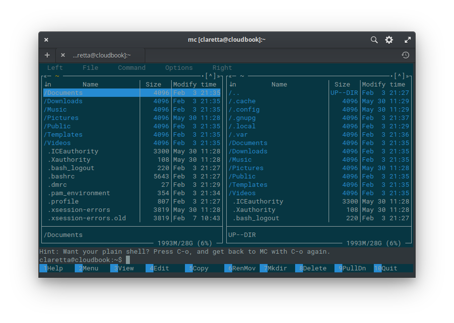
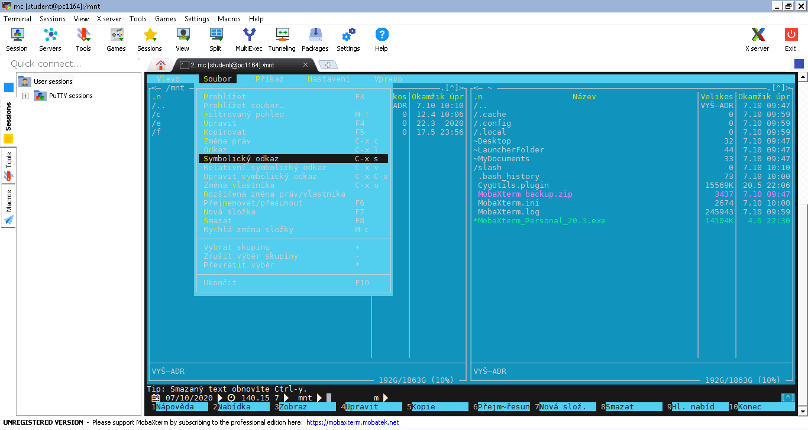



## Preface
There are many ways to run Linux & Linux programs on Windows - from command-line tools like cygwin, complex virtual machines, to the official Windows subsystem for Linux (WSL), included in Windows 10.

Here I intend to show what I consider the most simple ways to run Linux on Windows, for the purposes of biologists and other scientists. I will also give some tips on how to setup the system for easier use. In particular I will focus on two options:

- The **Windows subsystem for Linux** (WSL), ideal for Windows 10 users with administrator privileges (needed only one time for installation).
- The **MobaXterm** application, which includes cygwin and many useful plugins in a convenient package. It is also available as a portable version, which can be run without administrator privileges. All current versions of Windows are supported.

## Windows subsystem for Linux (WSL)
If you run Windows 10, you are in luck, because your system includes an official Linux support. All you need to do is enable it with one command and download an app from the Microsoft store.

You can follow the [Ubuntu tutorial](https://ubuntu.com/tutorials/ubuntu-on-windows#1-overview), but here is the gist of it:

1. Open Microsoft Store (search it in your Start menu).
2. Search and install the [Ubuntu app](https://www.microsoft.com/en-us/store/p/ubuntu/9nblggh4msv6). There are a few versions, I usually install the rolling version without version number (i.e. just Ubuntu).
3. Launch the Ubuntu app (you can search it in Start menu again).
   - If it complains about something, follow the link provided in the message. The link will give you a command you should enter into Powershell as administrator. Just copy this command, open Start menu, search for "powershell" and select "Run as administrator". Then paste the command in the Powershell window and confirm with Enter.
   - Now re-launch the Ubuntu app.
4. The Ubuntu app will ask you to set user name and password. Fill in user name of choice and confirm with Enter, then type a password. There will be no characters shown, don't worry about it, it's a security feature and your password is typed. Confirm with Enter and retype it when asked.
5. The main system is now ready to be used.

### Updating the Ubuntu repositories
Ubuntu (and many other Linux distributions) uses curated software repositories, so you don't have to hunt for packages out on the wild internet. Before you can use them to install software, you should first **update** info about packages available in the repository and also **upgrade** packages we already have installed. This is done using the `apt` package manager by entering the following two commands:

    sudo apt update # updates info about packages available in the repository
    sudo apt upgrade # upgrades installed packages

The first command will ask for your user password, which we have set during the initial setup above. This is because we use the command `sudo` to get administrator privileges. The terminal will remember the password until you close it, so the following `sudo` commands don't ask for it again.

> **Note:** The `#` symbol represents start of a comment and the text after it doesn't really do anything. I just use it to explain what the given commands do. If you copy it with the command, nothing extra will happen.

It's a good idea to update your packages every now and then, using the two commands above. Once a week is a good middle ground. You can also upgrade whenever you read about some new security hole discovered - the patches are usually available within hours after the discovery, or one-two days at most.

### Installing the Midnight Commander
For every Windows user, I always install the Midnight Commander and do a little setup, for a few reasons:

- to show how installing Linux programs works in Ubuntu
- to make the Linux terminal less scary :)
- to make your files easier to access from the Linux terminal

> **Tip:** I have written about the Midnight Commander [before](linux_for_biologists.html#midnight-commander---the-savior).

If you have already finished the initial upgrade, we are ready to install the Midnight Commander. Just use this command:

    sudo apt install mc # installs Midnight Commander (MC) from Ubuntu repository

Then we can run this command to open it:

    mc # open MC

You will see a window similar to this:

## MobaXterm app
In case you don't have Windows 10 available (or you don't have admin access), the second best thing (in my opinion) is the excellent [MobaXterm application](https://mobaxterm.mobatek.net/). It is a single versatile package, containing many Linux command-line tools, as well as clients for remote access (pretty much all the protocols are covered). It even contains the Ubuntu `apt` package manager for installing packages.

As I said, it is possible to **install** MobaXterm as any other application on your system, or use the **portable version** which doesn't require admin privileges and can be run anywhere. The portable version only requires some quick extra setup in case you want to save its configuration and installed packages between sessions (which I will show below). If you install the normal version instead, you can skip the next section and [start using the app](#enabling-package-manager).

### Portable version setup
The portable version by default does not remember any changes and settings you do to it, but of course it is useful to have your MobaXterm keep the settings you change and programs you install. This only requires setting a folder in settings which will hold all the permanent stuff.

You just need to use the menu bar and navigate to **Settings > Configuration**. After the settings window opens, you see the **General** tab, where you need to set the **Persistent home directory** and **Persistent root directory** to some folder on your PC that doesn't get deleted (by default these are set to Temp, which is removed after you close MobaXterm).

After you set the folders for permanent files, confirm with the OK button. MobaXterm will ask you to restart the program to use the new setup. The permanent folders will not work until you restart it, so I recommend doing it now. When it restarts, you are good to go.

### Enabling package manager
When you open MobaXterm, it lets you open a local terminal directly from the welcome screen.

After starting the local terminal, you can run this command to enable the `apt` package manager and update the repository info:

    apt-get update # enable apt and update repository info

Confirm with `y` when asked. Note that `apt` is using older version of the command (`apt-get`) here and also does not require `sudo` to be used.

Then you can install the Midnight Commander (MC):

    apt-get install mc # installs Midnight Commander (MC) from Ubuntu repository

Then you can start MC by running:

    mc # open MC

And the MC will open, showing the default home folder.

## Make your life easier
So now you have the power of linux command line at your fingertips, with the useful MC to help you manage your files. What I recommend next is to setup links to your common folders for quick access. We will do this using MC and a little magic called **symbolic links**.

The MobaXterm already has a few links setup - we can see the `~Desktop`, the `~LauncherFolder`, and the `~MyDocuments`. They are marked with the tilda `~` symbol and they point to folders in your computer, like Desktop and your Documents.

On WSL, you usually don't have any links setup here, so let me show you how to get some links there. This will work in any MC, regardless if it's WSL, MobaXterm, or a real linux machine.

### Setup symbolic links to your folders
When you open MC in your terminal, it will always show you the so-called "home folder". On real linux, the absolute address (or *path*) would be `/home/username` or something similar. On our Windows machines, the system is slightly different, so it's using a so-called *prefixed environment*, but for our intents and purposes, you can disregard the difference. The point is, MC will always open in the same place. So let's make it more useful.

MC shows you two panels that allow to navigate your folders and files. You switch between panels with the Tab key, or you can click with a mouse (yes!). There is also a line of buttons at the bottom, numbered 1-10. These buttons can be activated with either mouse-click or the keys F1-F10 on your keyboard, and can open files for viewing (F3) or editing (F4), copy (F5) or move (F6) between folders in the two panels and so on.

Now it would be useful to know how to get to your normal Windows folders and files, so you can access them from the linux command line easily. After all, this is why we are doing all of this :)

On the top of each panel in MC you see `..`. You may remember from the MS DOS era that this symbolizes going up in the folder hierarchy. Let's go there now. First we get to the `/home` folder, going to `..` one more time gets us to the *root directory* of our prefixed linux environment. You can think of it as *Your computer* on Windows, but as you can see, there are no disk drives, like `C:\` or `D:\`. In linux, these are located in `/mnt`, so let's go there - select the `mnt` folder in MC and enter it. There you will see your disk drives.

Now select one of the drives, e.g. `c`, and then look at the menu bar on top of MC. There you can click on **File > Symbolic link** to create a symbolic link of your `C:\` drive in the folder in the other panel, which should be your home folder. In the dialog that shows up, you can just confirm with Enter and voila - you have a new link to your `C:\` drive in your home folder! Of course, nothing stops you from browsing your Windows drives now and creating all the links you need in your home folder. Make it your home ;)

## Comments
If you'd like to leave a comment, you can join the discussion at [Github](https://gist.github.com/janxkoci/ace55bb80f10c741c08cab824b8be095).