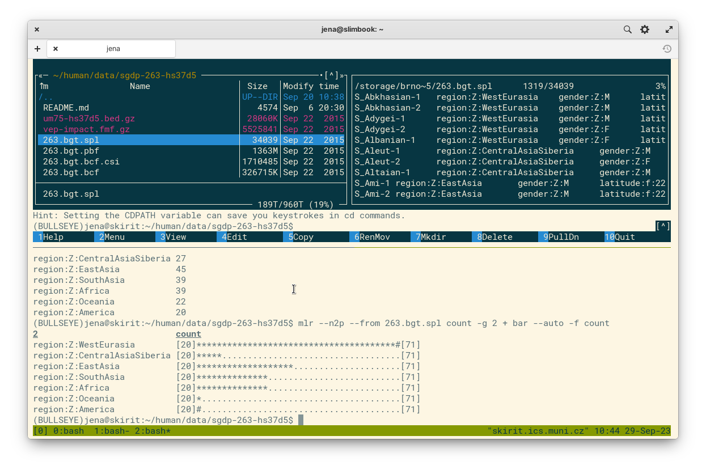
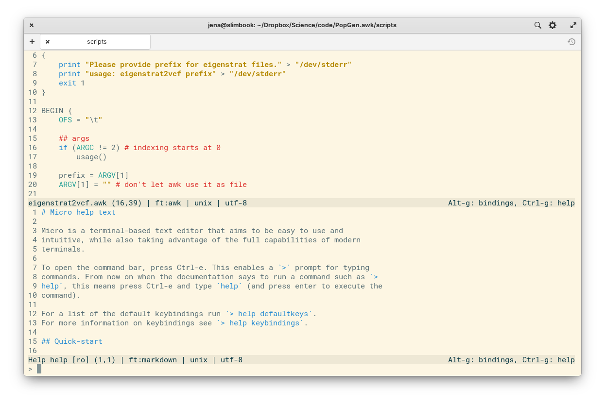
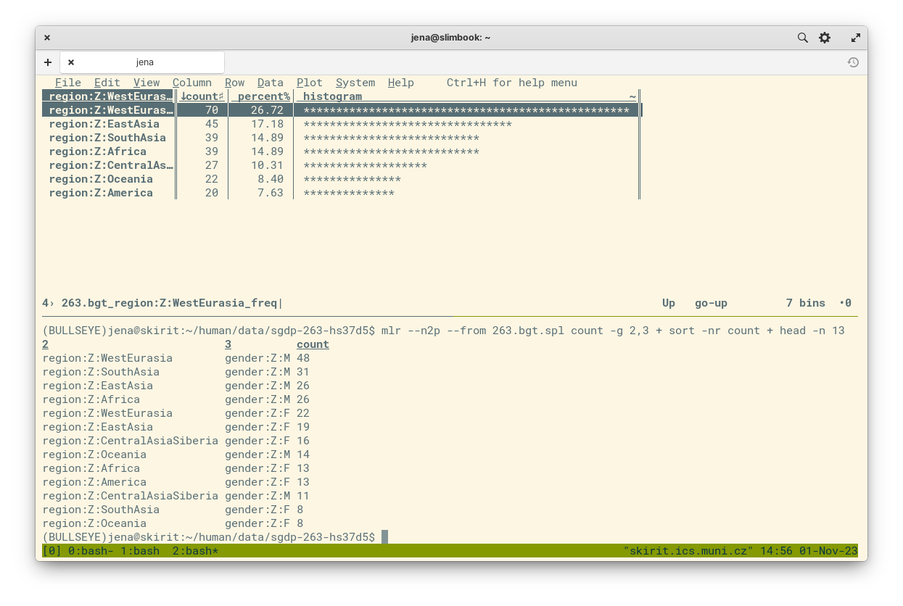
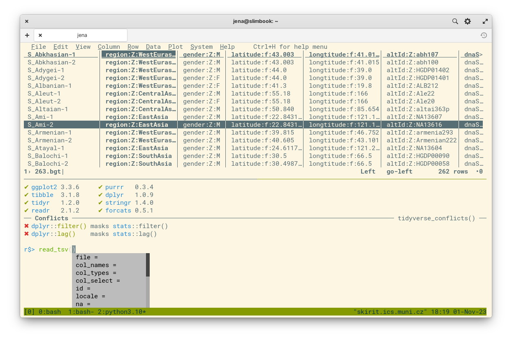
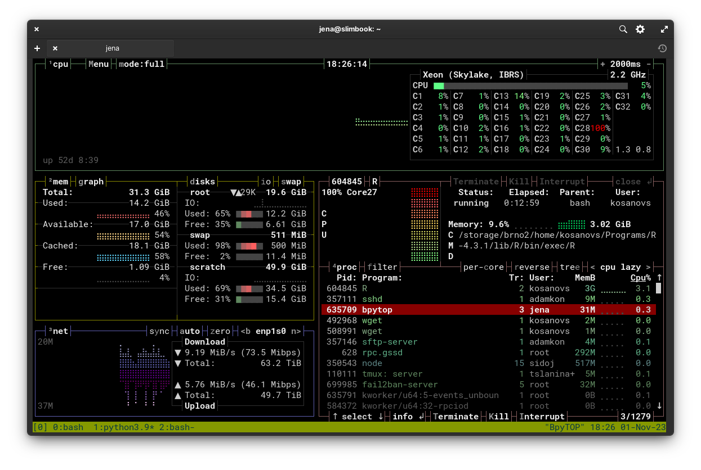



These are my friends for remote computing - handy little programs and tools that make my work at remote HPC clusters a lot nicer. Most of these friendly tools are command-line programs, but I will also show a few graphical tools and plugins that can make our life easier.

## Living in the terminal
HPC clusters are often used through the terminal. But the terminal does not have to be a scary place! A few helpful friends can make life there much easier.

### tmux (multitasking)
When first starting to work at remote servers or HPC clusters, beginners often quickly discover that running multiple programs at the same time is not as straightforward in the terminal as it is on their desktop. Moreover, the tasks will be interrupted when they log out (tasks other than jobs submitted to a queue system).

This is solved by **terminal multiplexers** - programs that allow you to multiplex your session to run several programs at once. They also keep your session live when you close the connection, so your work is not lost. This is not just a convenience though - if you ever worked on a train, you know how patchy the wifi network can be!

The most common terminal multiplexer is **GNU `screen`** - it is often preinstalled on HPCs, and it gets the job done. But I prefer another option - [**`tmux`**](https://github.com/tmux/tmux/wiki), which has several cool extra features. The main one being **split screen**! As you can see above, it allows to have multiple terminals with different programs side-by-side in one window.

> **Tip:** It's very convenient to run [interactive jobs](./linux_for_biologists.html#interactive-session-in-pbs) from tmux. Whenever during my work I need more resources for the next task, I can just quickly jump into an interactive job with [a handy script](https://gist.github.com/janxkoci/0b2b6467f15c907a7d07c78cbd0f2ffe) and continue on a compute node.

### midnight commander (file manager)
The [midnight commander](./linux_for_biologists.html#midnight-commander---the-savior), aka **`mc`**, is a powerful file manager for the terminal. It lets you visually browse your files, copy or move files between its two panes, compress and decompress files, and preview or edit their contents. It can browse inside archives, and it can connect to remote servers (with support for FTP/SFTP/SSH protocols), to let you manage your files in all possible places. It also supports mouse, so you can navigate files and menus with clicks and scrolling.

The `mc` includes two handy programs that can be used from within `mc` or separately: a file viewer `mcview` (invoked with **F3**) and text editor `mcedit` (invoked with **F4**). The viewer supports preview of large files (even compressed) and hex mode for binary files (if you are into that), or even simple PDF and HTML files like software manuals or science papers, while the editor has syntax highlighting for code, and a convenient find-and-replace feature.

### micro (text editor)
A good text editor is an important part of scientist's toolkit. Linux veterans and gurus will defend their favourite `vim` or `emacs`, but these can be quite intimidating to mere mortals. Simpler options include popular editor `nano`, or even `mcedit` mentioned above. But there is a new kid in town with some cool tricks up its sleeves!

I'm talking about [**`micro`**](https://micro-editor.github.io/) - a modern text editor that feels more like your familiar Sublime Text or VS Code than a terminal app. It uses **familiar keyboard shortcuts** like Ctrl+S to save files, or Ctrl+O to open files, and has a **full mouse support**, including drag-to-select text. It supports syntax highlighting, colour themes, tabs and split screen, and even _multiple cursors_ - my all-time favourite killer feature! Micro has the perfect blend of easy use and powerful features.

### visidata & miller (data processing)
Working with data is a big part of science. Moreover, datasets come with metadata, like sample information and experimental variables. Then, the results need to be processed and summarized. There are plenty of tools to handle these tasks, from spreadsheet apps like Excel or Calc, to languages like AWK or R. Most of these are best used on your personal computer, but there are two tools for such tasks that are useful directly on the HPCs - **`visidata`** and **`miller`**.

Like mc above, [**visidata**](https://www.visidata.org/) is a point-and-click "graphical" app for working with spreadsheets in your terminal. It provides many ways to browse and visualize your data, from quick summaries with frequency tables to custom python code applied to columns of data, and even simple [scatter plots](https://www.youtube.com/watch?v=Ozap_numsjI)! It can handle data with millions of rows in formats like XLSX, CSV, TSV, JSON, and [more](https://www.visidata.org/docs/formats/).

On the other hand, [**miller**](https://miller.readthedocs.io/) is a commandline tool, much like `awk`, `sed` or `cut`. That's because miller is trying to be like those tools, just better, bringing them to the 21st century, with support for new features and formats like CSV, TSV, JSON, all with column names for easy access. It's great for processing many large files, collect various statistics, do data reduction, or file conversions. It can even do quick barplots directly in the terminal, to quickly visualize trends in the data!

### radian / jupyter (interactive computing)
If you still want to work in R or Python at a HPC cluster, projects like Jupyter or Radian can help you with that. **Jupyter** is most famous for its Notebook interface for interactive computing, but the project also provides a console version with many enhancements for easier coding experience, with **code highlighting** and **autocomplete suggestions**. Jupyter supports over 50 kernels (some better than others though), including Julia, Python, and R (as in Ju-Pyt-eR).

[**Radian**](https://github.com/randy3k/radian) is an advanced R console, inspired by Jupyter and especially the Julia console. In addition to features common with the `jupyter-console`, it provides extra features like **shell and python modes**, allowing you to quickly run some shell or Python code without leaving your R session.

### btop (resource monitor)
To monitor resources and running processes, most folks usually reach for `htop`, but at HPCs with many processors, the default layout may not be great. Another project decided to solve this exact problem, while providing many other nice features - [**btop**](https://github.com/aristocratos/btop). The project went through three major iterations - bashtop, bpytop, and btop++ (written in Bash, Python, and C++, respectively). These generally provide the same features, with btop++ being the latest and under active development. On the other hand, **bpytop** is the easiest to install, as we will see with the next tool.

### mamba (package manager)
Installing software on HPC clusters can be a hassle, since most regular users don't have root privileges, and so cannot use the system package manager. But there are several popular **package managers for scientists** that don't require such privileges. These package managers let users install software in their home directory, keeping it isolated from the system and other users, which can avoid conflicts.

The most popular scientific package managers are `conda` and `brew`. While these are fine options, they are not very performant - especially `conda` became infamous for being very slow, especially with large software repositories like [conda-forge](https://conda-forge.org/). This is why **`mamba`** was created. It is a drop-in replacement of `conda` written in C++ for high performance, and it uses the same battle-tested and reliable dependency solver as distros like Fedora and OpenSUSE.

If you already have `conda`, you can install `mamba` easily. In fact, you can install most of the packages mentioned here like this:

	# install mamba
	conda install -c conda-forge mamba
	# use faster mamba to install the rest
	mamba install -c conda-forge tmux micro visidata miller radian jupyter_console bpytop

> **Note:** This doesn't install `mc`. It is available in another channel, but you probably won't need to install it - I have yet to see a HPC without mc already being in place.

See more in my [cheat sheet](./conda_cheatsheet.html) for `conda` and `mamba`!

## Life beyond the terminal
While working at a HPC cluster, you are not limited to just a terminal though.

### tiling terminals
If you like the split-screen feature of `tmux` and would like to use it also in your desktop terminal, you are in luck! Several terminal apps have this very feature. The good news is that today all major platforms have at least one option:

- **Linux:** [tilix](https://gnunn1.github.io/tilix-web/) or [terminator](https://gnome-terminator.org/)
- **macOS:** [iTerm2](https://iterm2.com/)
- **Windows:** [Windows terminal](https://apps.microsoft.com/detail/9N0DX20HK701)

With the split-screen feature, you can connect to several servers side-by-side and even run commands at once - most of them support synced input for all or selected sub-windows!

### SFTP clients
Managing files on remote servers can be done from graphical apps too. On Linux, most regular file managers like Nautilus, Dolphin, or Nemo have this feature built-in, while on Windows and macOS you can use dedicated SFTP clients like Filezilla or WinSCP (Windows only).

- Nautilus et al. (Linux, preinstalled)
- [WinSCP](https://winscp.net/eng/index.php) (Windows)
- [Filezilla](https://filezilla-project.org/download.php?type=client) (multiplatform)

> **Note:** Although Filezilla is a well-known and respectable open-source project, downloading it from websites often pulls in all kinds of questionable _baggage_. This is no issue on Linux with central repositories, but be careful on other platforms.

### text editor plugins
Many popular text editors have plugins for accessing files on SFTP servers. With these plugins, you can connect to a HPC and directly edit files using your favourite editor.

- [SFTP for Sublime Text](https://codexns.io/products/sftp_for_sublime)
- VS Code
