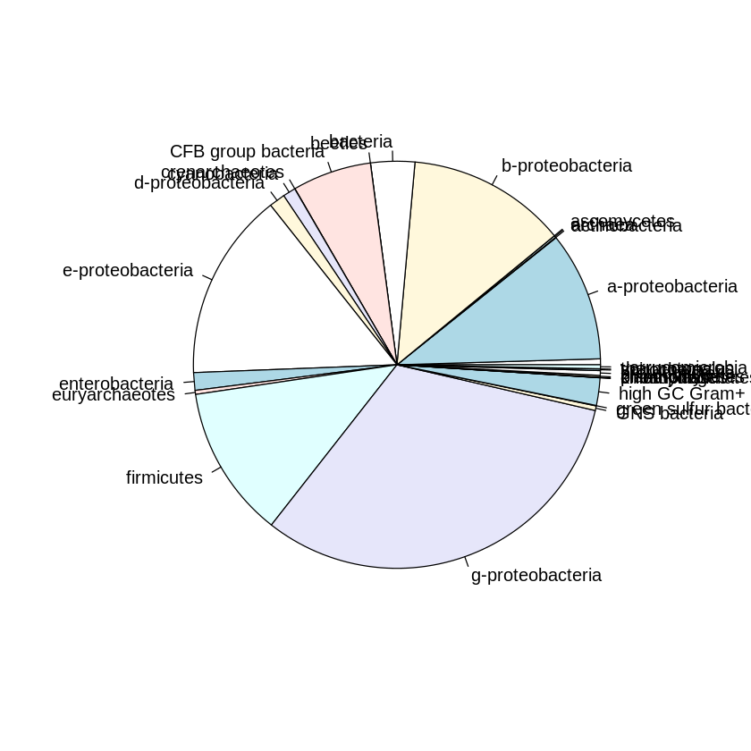
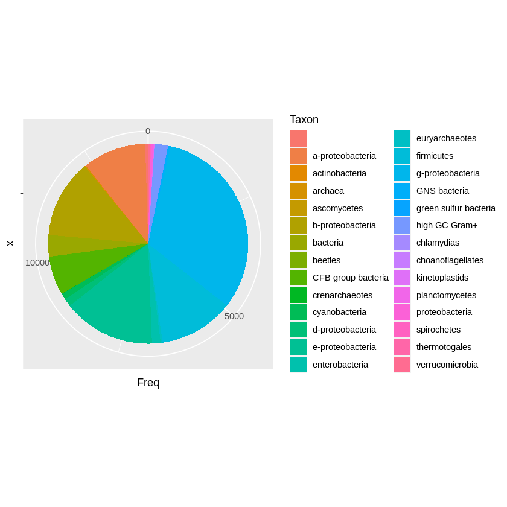

# Getting taxonomy from NCBI with `R` & `rentrez`

Recently, I happened to work with Blast a lot. At some point we wanted to get some high-level taxonomy for our dataset. I've never done this, but I know the NCBI provides a query interface called Entrez, which can be accessed from command-line tools as well as from several programming languages. In `R`, you can query the Entrez system with the [`rentrez`](https://cran.r-project.org/package=rentrez) package. Here I describe the basics of getting taxonomy information with this package.

Let's load our packages - `rentrez` and also `magrittr` (to get pipes for easier coding):


```R
options(repr.plot.width=7, repr.plot.height=7, jupyter.plot_scale = 1)

library(magrittr)
library(rentrez)
```

Here is the list of available databases:


```R
entrez_dbs()
```


<style>
.list-inline {list-style: none; margin:0; padding: 0}
.list-inline>li {display: inline-block}
.list-inline>li:not(:last-child)::after {content: "\00b7"; padding: 0 .5ex}
</style>
<ol class=list-inline><li>'pubmed'</li><li>'protein'</li><li>'nuccore'</li><li>'ipg'</li><li>'nucleotide'</li><li>'structure'</li><li>'genome'</li><li>'annotinfo'</li><li>'assembly'</li><li>'bioproject'</li><li>'biosample'</li><li>'blastdbinfo'</li><li>'books'</li><li>'cdd'</li><li>'clinvar'</li><li>'gap'</li><li>'gapplus'</li><li>'grasp'</li><li>'dbvar'</li><li>'gene'</li><li>'gds'</li><li>'geoprofiles'</li><li>'homologene'</li><li>'medgen'</li><li>'mesh'</li><li>'ncbisearch'</li><li>'nlmcatalog'</li><li>'omim'</li><li>'orgtrack'</li><li>'pmc'</li><li>'popset'</li><li>'proteinclusters'</li><li>'pcassay'</li><li>'protfam'</li><li>'biosystems'</li><li>'pccompound'</li><li>'pcsubstance'</li><li>'seqannot'</li><li>'snp'</li><li>'sra'</li><li>'taxonomy'</li><li>'biocollections'</li><li>'gtr'</li></ol>


The basic command to get taxonomy for an ID:


```R
taxo <- entrez_summary(db="taxonomy", id="1219383")
str(taxo)
```

    List of 13
     $ uid             : chr "1219383"
     $ status          : chr "active"
     $ rank            : chr "species"
     $ division        : chr "g-proteobacteria"
     $ scientificname  : chr "Acinetobacter boissieri"
     $ commonname      : chr ""
     $ taxid           : int 1219383
     $ akataxid        : chr ""
     $ genus           : chr "Acinetobacter"
     $ species         : chr "boissieri"
     $ subsp           : chr ""
     $ modificationdate: chr "2015/07/31 00:00"
     $ genbankdivision : chr "Bacteria"
     - attr(*, "class")= chr [1:2] "esummary" "list"


You can extract just the part you want with `$`:


```R
entrez_summary(db="taxonomy", id="1219383")$division
```


'g-proteobacteria'


## Search & links

But suppose for a moment that we do not have the `staxids` - can we still get this information with e.g. accession number (`saccver` or similar)?

Of course we can!

Let's say we want to search the taxonomy for accession number `WP_092748568.1`. We start by searching the **protein database**, where the accession number comes from:


```R
entrez_search(db="protein", term="WP_092748568.1")
```


    Entrez search result with 1 hits (object contains 1 IDs and no web_history object)
     Search term (as translated):   


We see there is 1 hit, but it doesn't show any information about it - yet. You could save the result of the query into an object and expect it with `str()` - or we can use `magrittr` pipe directly on the query:


```R
entrez_search(db="protein", term="WP_092748568.1") %>% str
```

    List of 5
     $ ids             : chr "1224730548"
     $ count           : int 1
     $ retmax          : int 1
     $ QueryTranslation: chr ""
     $ file            :Classes 'XMLInternalDocument', 'XMLAbstractDocument' <externalptr> 
     - attr(*, "class")= chr [1:2] "esearch" "list"


Now we can see the **internal NCBI ID** of this item, under the `$ids` slot. We can now look up what other information is *linked* to this ID:


```R
ncbi_id <- entrez_search(db="protein", term="WP_092748568.1")$ids

entrez_link(dbfrom="protein", id=ncbi_id, db="all") %>% str
```

    List of 2
     $ links:List of 16
      ..$ protein_cdd                    : chr [1:16] "415644" "399551" "395146" "236886" ...
      ..$ protein_cdd_concise_2          : chr "163712"
      ..$ protein_cdd_specific_2         : chr "163712"
      ..$ protein_cdd_summary_nonpublic  : chr [1:13] "395146" "223824" "215328" "215003" ...
      ..$ protein_cdd_superfamily_2      : chr "415644"
      ..$ protein_nuccore                : chr "1224732327"
      ..$ protein_protein_cdart_summary  : chr "1224730548"
      ..$ protein_sparcle                : chr "10169238"
      ..$ protein_taxonomy               : chr "1219383"
      ..$ protein_bioproject             : chr "224116"
      ..$ protein_cdd_summary            : chr [1:16] "415644" "399551" "395146" "236886" ...
      ..$ protein_nuccore_wp             : chr "1224732327"
      ..$ protein_protein_cdart          : chr "1224730548"
      ..$ protein_protein_cdart_summary_2: chr "1224730548"
      ..$ protein_protfam                : chr [1:7] "326225" "315947" "246230" "246128" ...
      ..$ protein_taxonomy_wp2species    : chr "1219383"
      ..- attr(*, "class")= chr [1:2] "elink_classic" "list"
     $ file :Classes 'XMLInternalElementNode', 'XMLInternalNode', 'XMLAbstractNode' <externalptr> 
     - attr(*, "content")= chr " $links: IDs for linked records from NCBI\n "
     - attr(*, "class")= chr [1:2] "elink" "list"


As we can see, there is a link to the **taxonomy database**, showing us an id "1219382". Now we can reuse this ID in our query:


```R
our_id <- entrez_link(dbfrom="protein", id=ncbi_id, db="all")$links$protein_taxonomy

entrez_summary(db="taxonomy", id=our_id) %>% str
```

    List of 13
     $ uid             : chr "1219383"
     $ status          : chr "active"
     $ rank            : chr "species"
     $ division        : chr "g-proteobacteria"
     $ scientificname  : chr "Acinetobacter boissieri"
     $ commonname      : chr ""
     $ taxid           : int 1219383
     $ akataxid        : chr ""
     $ genus           : chr "Acinetobacter"
     $ species         : chr "boissieri"
     $ subsp           : chr ""
     $ modificationdate: chr "2015/07/31 00:00"
     $ genbankdivision : chr "Bacteria"
     - attr(*, "class")= chr [1:2] "esummary" "list"


Cool. Now we can get taxonomic information for one sample. But what if we have 5 - or 5000?

Yes we can! In particular, we can supply most of the functions we used with a *vector of IDs* instead of just one ID. But let's get some data first.

## Real data - Blast output

I started with a `blastp` output in tabular format with few extra columns - in particular the accession number and Tax ID, so you need at least this: `-outfmt '7 saccver staxids'` to get taxonomy IDs for your blast hits (note that `saccver` is part of standard blast output, which can be specified with the `std` format keyword).

> **Note:** You can also ask blast to provide e.g. scientific names, however so many of them were missing in my queries that I just gave up on using that.

Since `staxids` can include multiple IDs separated by `;`, I had to process the data slightly with `awk` before they were ready:

```bash
# take columns 2 (saccver) and 13 (staxids) from blast output table (skipping header)
awk -F"\t" '!/#/ {print $2, $13}' blastp_outfmt7_std_staxids.tsv > blastp_saccver_staxids.txt

# expand items with multiple staxids row-wise by replacing ";" with "newline+saccver+space"
awk '{gsub(/;/, "\n"$1" ", $2); print $0}' blastp_saccver_staxids.txt > blastp_saccver_staxids_expanded.txt
```

Now we are ready to load the data into `R`:


```R
taxa <- read.table("blastp_saccver_staxids_expanded.txt", h=F, sep=" ") #, stringsAsFactors = T)
colnames(taxa) <- c("acc", "id")
str(taxa)
```

    'data.frame':	13842 obs. of  2 variables:
     $ acc: chr  "WP_092748568.1" "WP_023273437.1" "WP_023273437.1" "WP_088823490.1" ...
     $ id : int  1219383 1219382 1392540 1229165 29545 2691581 1907941 86304 203122 2675457 ...


### Test data (10 ids)
So far we used the function `str()` to see results of our queries and to figure out which data to extract with `$`. Of course this is not practical for bulk queries with multiple IDs. For this reason there is a helper function - `extract_from_esummary()`. It accepts a list of results from your query and a name of the field you want to extract. We can pipe into it as usual:


```R
entrez_summary(db="taxonomy", id=taxa$id[1:10]) %>% extract_from_esummary("division")
```


<style>
.dl-inline {width: auto; margin:0; padding: 0}
.dl-inline>dt, .dl-inline>dd {float: none; width: auto; display: inline-block}
.dl-inline>dt::after {content: ":\0020"; padding-right: .5ex}
.dl-inline>dt:not(:first-of-type) {padding-left: .5ex}
</style><dl class=dl-inline><dt>1219383</dt><dd>'g-proteobacteria'</dd><dt>1219382</dt><dd>'g-proteobacteria'</dd><dt>1392540</dt><dd>'g-proteobacteria'</dd><dt>1229165</dt><dd>'g-proteobacteria'</dd><dt>29545</dt><dd>'b-proteobacteria'</dd><dt>2691581</dt><dd>'b-proteobacteria'</dd><dt>1907941</dt><dd>'g-proteobacteria'</dd><dt>86304</dt><dd>'g-proteobacteria'</dd><dt>203122</dt><dd>'g-proteobacteria'</dd><dt>2675457</dt><dd>'b-proteobacteria'</dd></dl>


### Full data (~90k ids)

The basic command to extract taxonomy through Entrez looks like this:

```R
entrez_summary(db="taxonomy", id=taxa$id) %>% extract_from_esummary("division")
```

I cannot actually ask Entrez to give me all data at once - they limit queries to certain (unknown) size. After a bit of experimenting, I found I can get **400 items at a time**. So in reality, we need to divide the data into chunks and loop over the chunks to get the full dataset.

> **Note:** the `rentrez` [tutorial](https://cran.r-project.org/web/packages/rentrez/vignettes/rentrez_tutorial.html) says I should use **web history** feature for large queries, however **this option has the same limit** on items as getting them directly. So I skipped web history and just got the stuff I needed directly. `¯\_(ツ)_/¯`


```R
nrow(taxa)
(nrow(taxa)/400) %>% round
```


13842


35


[Divide data into chunks](https://stackoverflow.com/a/3321659) of 400 IDs and store them in a list:


```R
id_list <- (seq_along(taxa$id)/400) %>% ceiling %>% split(taxa$id,.)
```

Use `lapply` to loop over the list using our extraction command:


```R
all_division <- lapply(id_list, function(x) {entrez_summary(db="taxonomy", id=x) %>%
                             extract_from_esummary(., "division")})
```

    Warning message:
    “ID 332056 produced error 'cannot get document summary'”
    Warning message:
    “ID 2044510 produced error 'cannot get document summary'”
    Warning message:
    “ID 2694937 produced error 'cannot get document summary'”
    Warning message:
    “ID 2024862 produced error 'cannot get document summary'”
    Warning message:
    “ID 2660640 produced error 'cannot get document summary'”
    Warning message:
    “ID 2660639 produced error 'cannot get document summary'”
    Warning message:
    “ID 2731243 produced error 'cannot get document summary'”
    Warning message:
    “ID 1330039 produced error 'cannot get document summary'”
    Warning message:
    “ID 262776 produced error 'cannot get document summary'”
    Warning message:
    “ID 2529841 produced error 'cannot get document summary'”
    Warning message:
    “ID 2731248 produced error 'cannot get document summary'”
    Warning message:
    “ID 2731248 produced error 'cannot get document summary'”
    Warning message:
    “ID 2529844 produced error 'cannot get document summary'”
    Warning message:
    “ID 332056 produced error 'cannot get document summary'”
    Warning message:
    “ID 2529844 produced error 'cannot get document summary'”
    Warning message:
    “ID 2027912 produced error 'cannot get document summary'”
    Warning message:
    “ID 2660639 produced error 'cannot get document summary'”
    Warning message:
    “ID 2660640 produced error 'cannot get document summary'”
    Warning message:
    “ID 262776 produced error 'cannot get document summary'”
    Warning message:
    “ID 262776 produced error 'cannot get document summary'”


Now we can see the taxonomic representation in our dataset.

> Note the `magrittr` "T-pipe" `%T>%` in the following command - it alows side-piping data into a plot, but also reusing it (here for printing the output of `table`). The extra pipes are the main reason I use the original `magrittr` package instead of e.g. `dplyr`.


```R
all_division %>% unlist %>% table %T>% pie %>% sort(decreasing=T)
```


    .
         g-proteobacteria      e-proteobacteria      b-proteobacteria 
                     4419                  2066                  1749 
               firmicutes      a-proteobacteria    CFB group bacteria 
                     1671                  1418                   867 
                 bacteria         high GC Gram+        enterobacteria 
                      483                   302                   193 
         d-proteobacteria         cyanobacteria                       
                      176                   140                    65 
           proteobacteria          GNS bacteria        euryarchaeotes 
                       52                    51                    44 
          verrucomicrobia               archaea        planctomycetes 
                       43                    20                    18 
              spirochetes        actinobacteria        kinetoplastids 
                       18                     7                     6 
    green sulfur bacteria        crenarchaeotes         thermotogales 
                        5                     3                     2 
              ascomycetes               beetles            chlamydias 
                        1                     1                     1 
        choanoflagellates 
                        1 


    

    


Wow, pretty... ugly. Let's see what `ggplot2` can do..

## ggplot, just for fun


```R
library(ggplot2)
```


```R
df <- all_division %>% unlist %>% table %>% as.data.frame

colnames(df) <- c("Taxon", "Freq")
head(df)
```


<table class="dataframe">
<caption>A data.frame: 6 × 2</caption>
<thead>
	<tr><th></th><th scope=col>Taxon</th><th scope=col>Freq</th></tr>
	<tr><th></th><th scope=col>&lt;fct&gt;</th><th scope=col>&lt;int&gt;</th></tr>
</thead>
<tbody>
	<tr><th scope=row>1</th><td>                </td><td>  65</td></tr>
	<tr><th scope=row>2</th><td>a-proteobacteria</td><td>1418</td></tr>
	<tr><th scope=row>3</th><td>actinobacteria  </td><td>   7</td></tr>
	<tr><th scope=row>4</th><td>archaea         </td><td>  20</td></tr>
	<tr><th scope=row>5</th><td>ascomycetes     </td><td>   1</td></tr>
	<tr><th scope=row>6</th><td>b-proteobacteria</td><td>1749</td></tr>
</tbody>
</table>


```R
ggplot(df, aes(x = "", y = Freq, fill = Taxon)) +
  geom_col() +
  coord_polar(theta = "y")
```


    

    


It is much nicer looking, but I actually have a problem distinguishing the different colours in the plot. I *am* colourblind, sure, but I think there is just too many colours for anyone to handle.


```R
df$Taxon %>% unique %>% length
```


28


**28 categories** - that's a lot! Well I think for this amount of data the base R is better - by default. There might be a way to improve both plots, but this is not the time nor place. See you next time 😉️
